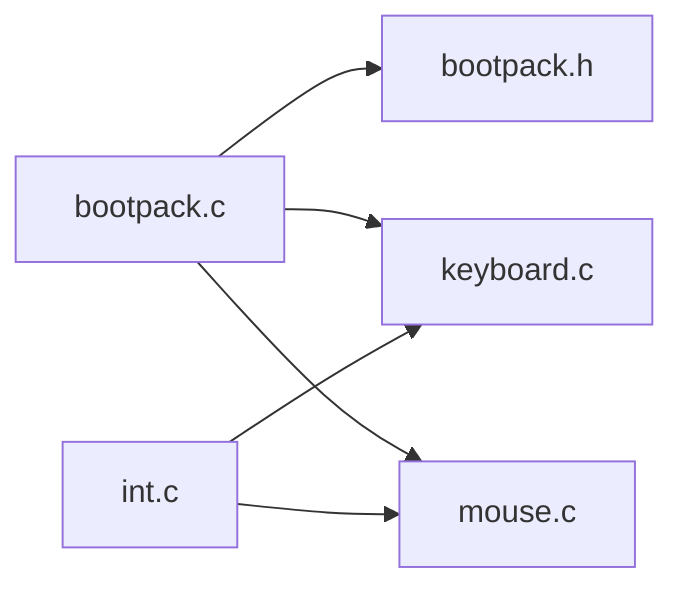

Next: [harib06b](harib06b.md), Previous: [protected-mode](protected-mode.md), Up: [Chapter9](chapter9.md)

----

# Chapter9

## harib06a

### 課題

ソースファイルを整理する。

### 学習

宣言・定義・関数を bootpack.c, int.c から bootpack.h, keyboard.c, mouse.c へ移動する。

|移動元|移動先|内容|
|------|------|----|
|bootpack.c|bootpack.h|MOUSE\_DEC, PORT\_KEYDAT, PORT\_KEYCMD|
|bootpack.c|keyboard.c|PORT\_KEYSTA, KEYSTA\_SEND\_NOTREADY, KEYCMD\_WRITE\_MODE, KBC\_MODE, wait\_KBC\_sendready(), init\_keyboard()|
|bootpack.c|mouse.c|KEYCMD\_SENDTO\_MOUSE, MOUSECMD\_ENABLE, enable\_mouse(), mouse\_decode()|
|int.c|keyboard.c|keyfifo, inthandler21()|
|int.c|mouse.c|mousefifo, inthandler2c()|

### 成果

- [Makefile](/Makefile)
    - keyboard.c, mouse.c を追加
- [bootpack.c](/bootpack.c)
    - キーボード関連とマウス関連の定義・関数を移動
- [bootpack.h](/bootpack.h)
    - キーボード関連とマウス関連の宣言を移動
- [int.c](/int.c)
    - キーボード関連とマウス関連の定義・関数を移動
- [keyboard.c](/keyboard.c)
    - キーボード関連の関数を bootpack.c, int.c から移動
- [mouse.c](/mouse.c)
    - マウス関連の関数を bootpack.c, int.c から移動

----

Next: [harib06b](harib06b.md), Previous: [protected-mode](protected-mode.md), Up: [Chapter9](chapter9.md)
